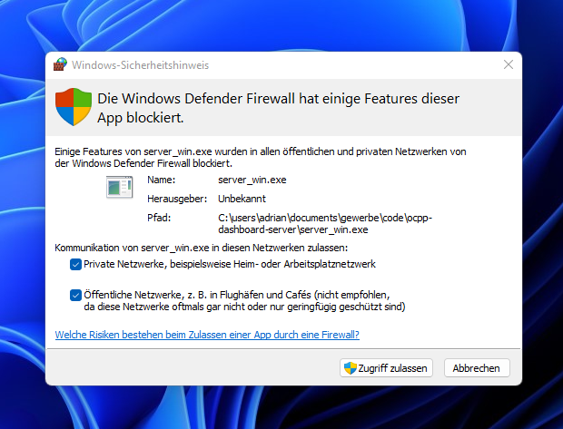
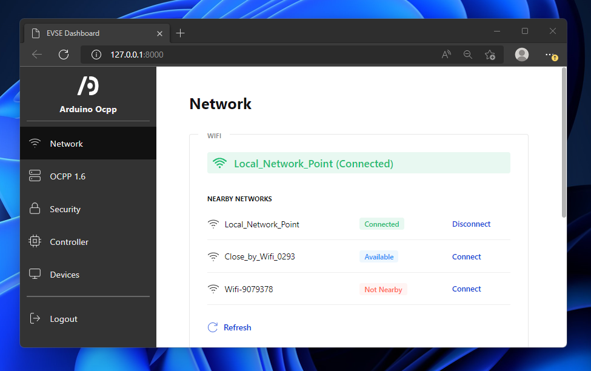

# Arduino Ocpp Demo

This repository contains a dashboard demo for the [Arduino Ocpp library](https://github.com/matth-x/ArduinoOcpp).

## Running the Demo

*Note:* This Demo is Windows only at the moment.

### Download or Clone the Repository

If you are not that familiar with GitHub, you can download the code as a *.zip* file. To do so, click on the **Code** button. It is located right on the top of this page above the file list. Download the *.zip* file and unpack it to a location of your choosing. Then enter the unpacked folder.

### Start the embedded server

Now you should see the *server_win.exe* file in the opened folder. Double click it to start the program that runs the server.

Because the program needs to use your network, it is very likely that a Windows Defender warning will pop up. You have to check both boxes and accept for the program to work.

*Note:* This pop-up is in german, but it should look the same in english.

Now a window should be opened showing some text output. This is perfectly normal. If you close this window the program will be stopped and the demo will not work anymore.

### Open the Dashboard Demo

Now open the browser of your choice and navigate to [http://127.0.0.1:8000](http://127.0.0.1:8000). You should see an interactive demo.

